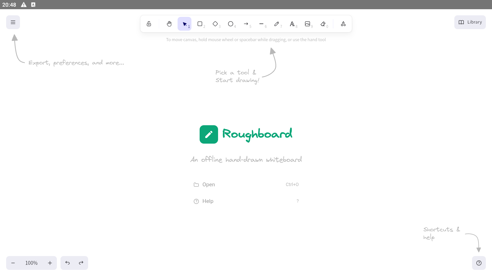

# Roughboard

**An offline, native Android build of the open-source [Excalidraw](https://github.com/excalidraw/excalidraw) hand-drawn whiteboard editor.**

Roughboard packages the Excalidraw editor into a real, installable Android app
that runs **fully offline** — no account, no server, no network. Your drawings
never leave your device.

> **Disclaimer:** Roughboard is an independent project and is **not affiliated
> with, endorsed by, or sponsored by Excalidraw**. "Excalidraw" is a trademark of
> its respective owner and is referenced only to credit the open-source editor
> this app is built on. See [THIRD_PARTY_LICENSES.md](THIRD_PARTY_LICENSES.md).



## Features

- The complete Excalidraw editor — shapes, freedraw, arrows, text, images, the
  shape library, multi-select, full styling (stroke/background/fill/width/
  opacity/layers/fonts), zoom & pan.
- **Fully offline** — editor + all fonts bundled into the APK.
- **Touch-native** drawing, selecting and panning.
- **Stylus-friendly** — pressure-sensitive freehand drawing; a menu setting
  cycles touch handling through **off / palm rejection / pen-only** (pen-only:
  finger pans & pinch-zooms, only the stylus draws), plus optional
  **pen-eraser-tip** support. (Pen pressure, the eraser tip, and pinch-zoom are
  best verified on real stylus hardware.)
- **Local persistence** — scene, library and theme auto-saved on-device.
- **Native export/share** — "Save to disk" and "Export image" (PNG/SVG) go
  through the Android share sheet.
- Branded launcher icon and in-app About / open-source licenses screen.

## Why

Excalidraw is fantastic but ships as a web app — there's no official Android app
on the Play Store. Roughboard makes it a first-class, offline Android app.

## Build

**Prerequisites:** Node.js 20+, JDK 21, Android SDK (platform-tools,
`platforms;android-35`, `build-tools;35.0.0`). Point `android/local.properties`
at your SDK (`sdk.dir=...`). Built with Capacitor 7 / AGP 8.7.2 / Gradle 8.11.1.

```bash
npm install
npm run build               # copy-assets runs via the build pipeline; see scripts/
npx cap sync android

# Debug APK
cd android && ./gradlew assembleDebug

# Release AAB (for Play) / APK
./gradlew bundleRelease      # android/app/build/outputs/bundle/release/app-release.aab
./gradlew assembleRelease    # android/app/build/outputs/apk/release/app-release.apk
```

> Run `npm run copy-assets` once after install to copy the Excalidraw fonts into
> `public/` for offline use (the build expects them there).

### Signing

Release signing reads from **`android/keystore.properties`** (git-ignored, never
committed). Create it with your own upload keystore:

```properties
storeFile=roughboard-release.keystore
storePassword=********
keyAlias=roughboard
keyPassword=********
```

Generate a keystore with `keytool -genkeypair -v -keystore android/app/roughboard-release.keystore -alias roughboard -keyalg RSA -keysize 2048 -validity 10000`.
Without `keystore.properties`, release builds are produced unsigned.

## Architecture

A Vite + React app mounts the official `@excalidraw/excalidraw` component;
[Capacitor](https://capacitorjs.com) wraps it in a native Android shell.
`src/capacitor-bridge.js` routes the editor's web-style file downloads to the
native share sheet (Filesystem + Share plugins), since Android WebViews can't do
blob downloads. `index.html` removes the WebView's broken File System Access API
so the editor uses its bridgeable legacy path.

| Path | Purpose |
| --- | --- |
| `src/App.jsx` | Mounts the editor, persistence, custom welcome + About screens |
| `src/capacitor-bridge.js` | Download → native share interceptor |
| `src/about.jsx` | In-app attribution / licenses screen |
| `scripts/copy-excalidraw-assets.mjs` | Copies fonts into `public/` for offline use |
| `scripts/gen-icons.py` | Regenerates launcher + Play Store icons |
| `android/` | Capacitor Android project |

## Releasing to Google Play

See **[RELEASE.md](RELEASE.md)** for the full step-by-step checklist (AAB, store
listing, data safety, content rating, testing requirements, and paid-app setup).

## License

- Roughboard's own code: [MIT](LICENSE) © 2026 Ramazan Kara.
- Bundled third-party software (Excalidraw, Capacitor, React, Vite — MIT; fonts —
  OFL-1.1): see [THIRD_PARTY_LICENSES.md](THIRD_PARTY_LICENSES.md).
- Privacy: [PRIVACY.md](PRIVACY.md) — Roughboard collects no data.
